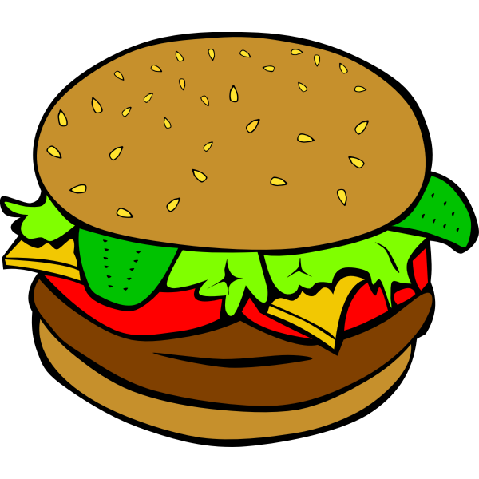
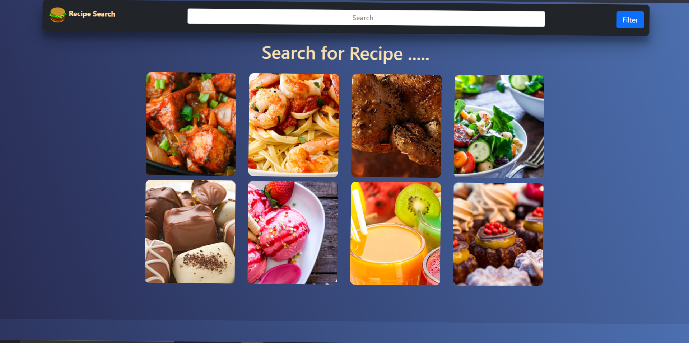
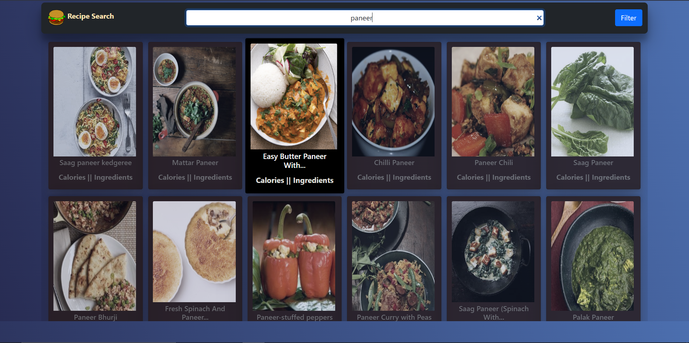
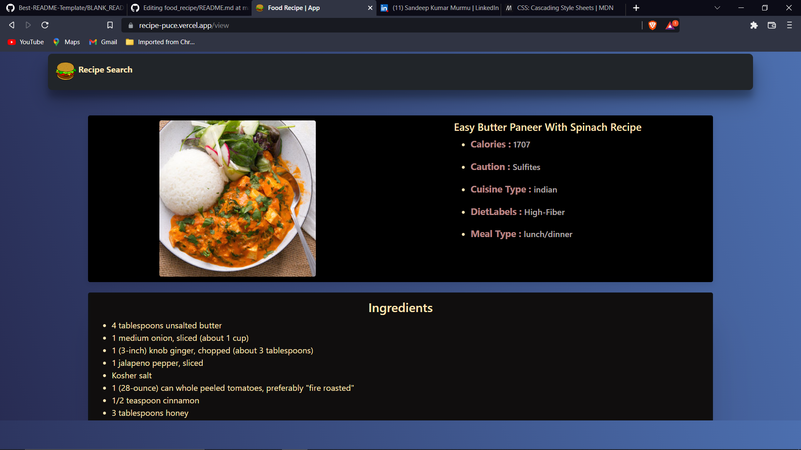

<!--top-->

<!-- PROJECT LOGO -->

 

  
<h3 align="center">Food Recipe App</h3>

  

   Dishes recipe searching app, along with thier calory and other datas are available....
     
    <a href="https://github.com/sandeepKumarMurmu/food_recipe/tree/main/recipe"><strong>Source code»</strong></a>
     
     
    <a href="recipe-puce.vercel.app/">Explore web-site</a>
    
  

<!-- TABLE OF CONTENTS -->

  
Table of Contents

  <ul>
    <li>
      <a href="#about-the-project">About The Project</a>
      <ul>
         <li><a href="#pages">Pages</a>
           <ul>
             <li><a href="#landing-page">Landing page</a>
             <li><a href="#listing-page">Listing page</a>
             <li><a href="#view-page">View page</a>
           </ul>
        </li>
         <li><a href="#features">Features</a></li>
         <li><a href="#built-with">Built With</a></li>
      </ul>
    </li>
  </ul>

<!-- ABOUT THE PROJECT -->
## About The Project
### Pages
##### Landing page
 

<a href="#top">back to top</a>

##### Listing page
 

<a href="#top">back to top</a>

##### View page
 

<a href="#top" >back to top</a>

### Features

* User is able to search for any recipe
* User can make filter of searched recipe
* User can also search for the based on only the applicable filter ( need not to give the recipe name in the search box)
* User can view the detail and also see the ingreadients required and their measurement
* one additional feature is, user can make a quice search based on the dashboard items

<a href="#top">back to top</a>

### Built With

* 
* 
* 
* 
* 
* 

<a href="#top">back to top</a>

